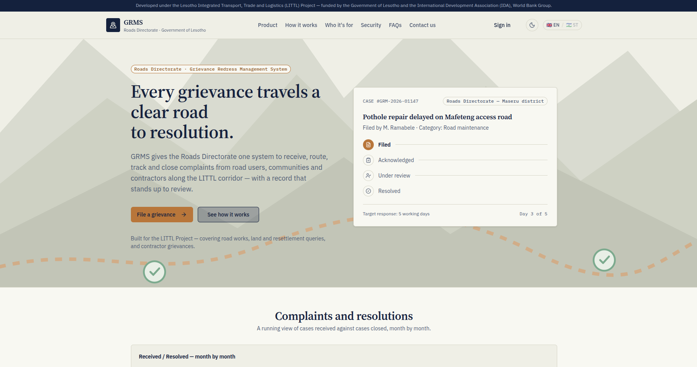
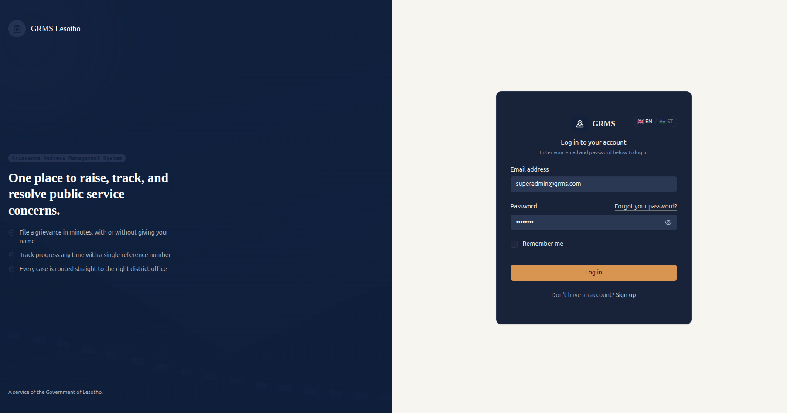
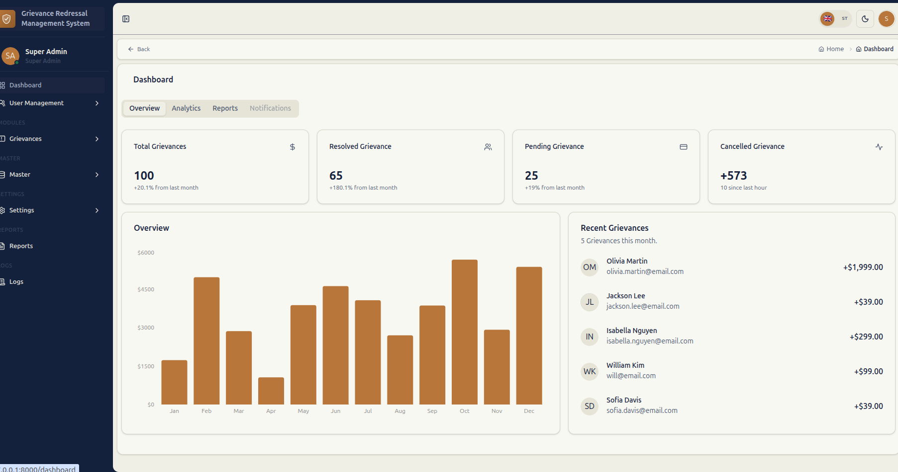
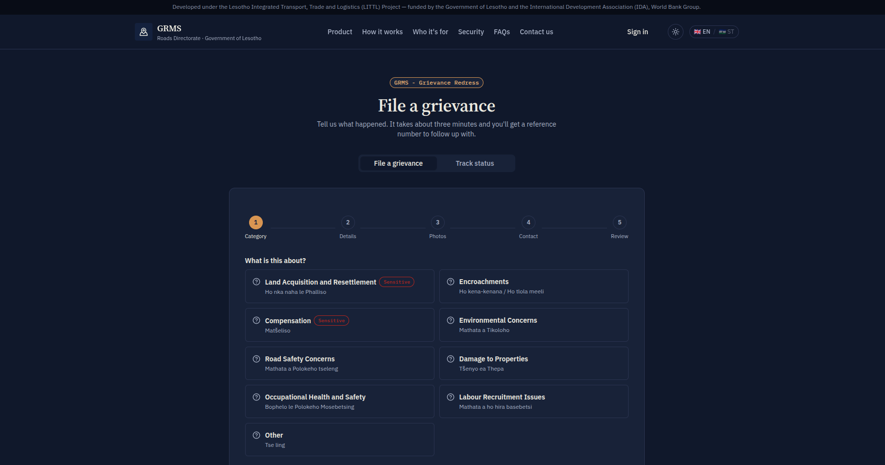

# GRMS — [Full Project Name Here]

> Replace this line with a one-sentence description of what GRMS does and who it's for.

🔗 **Live site:** [https://grms.amitdev.com.np](https://grms.amitdev.com.np)


---

## 📖 About

GRMS (**G**___ **R**___ **M**anagement **S**ystem — expand the acronym here) is a web application built to [describe the core problem it solves in 2–3 sentences — who uses it, what it manages, why it exists].

## ✨ Features

- Feature one — short description
- Feature two — short description
- Feature three — short description
- Role-based access (admin / staff / user, etc. — adjust to your app)
- *(add more as the project grows)*

## 🖼️ Screenshots

> Add screenshots as you build them. Create a `docs/screenshots/` folder in the repo, drop images there, and reference them like below.

| Dashboard | Login |
|---|---|
|  |  |

| Reports | Mobile View |
|---|---|
|  |  |

## 🛠️ Tech Stack

- **Backend:** Laravel 13 (PHP)
- **Frontend:** React + Inertia.js
- **Build tool:** Vite
- **Database:** MySQL
- **Hosting:** cPanel shared hosting
- **CI/CD:** GitHub Actions → deploy on push to `master`

## 🚀 Local Development Setup

```bash
# Clone the repo
git clone https://github.com/amitdev/grmsproject.git
cd grmsproject

# Backend setup
composer install
cp .env.example .env
php artisan key:generate

# Configure your local database in .env, then:
php artisan migrate --seed

# Frontend setup
npm install
npm run dev

# In a separate terminal, serve the app
php artisan serve
```

Visit `http://localhost:8000`.

## 🔄 Deployment

This project auto-deploys to production whenever code is pushed to the `master` branch, via a GitHub Actions workflow (`.github/workflows/deploy.yml`):

1. Checkout code
2. Install Composer + NPM dependencies
3. Build frontend assets (`npm run build`)
4. Sync build output to the server over SSH (rsync)
5. Run `php artisan migrate --force`, cache clearing/rebuilding, and `queue:restart` on the server

Manual deploy is not needed — just `git push origin master`.

## 📂 Project Structure Notes

- `.env` and `storage/` on the production server are managed manually and are **not** overwritten by deploys.
- Uploaded files live in `storage/app/public` and are symlinked to `public/storage`.

## 🤝 Contributing

This is currently a solo/internal project. If that changes, add contribution guidelines here.

## 📄 License

[Choose a license — MIT, proprietary, etc.]
